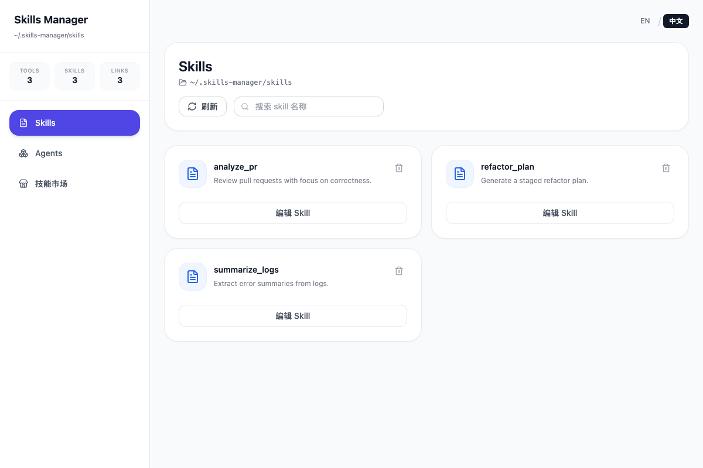
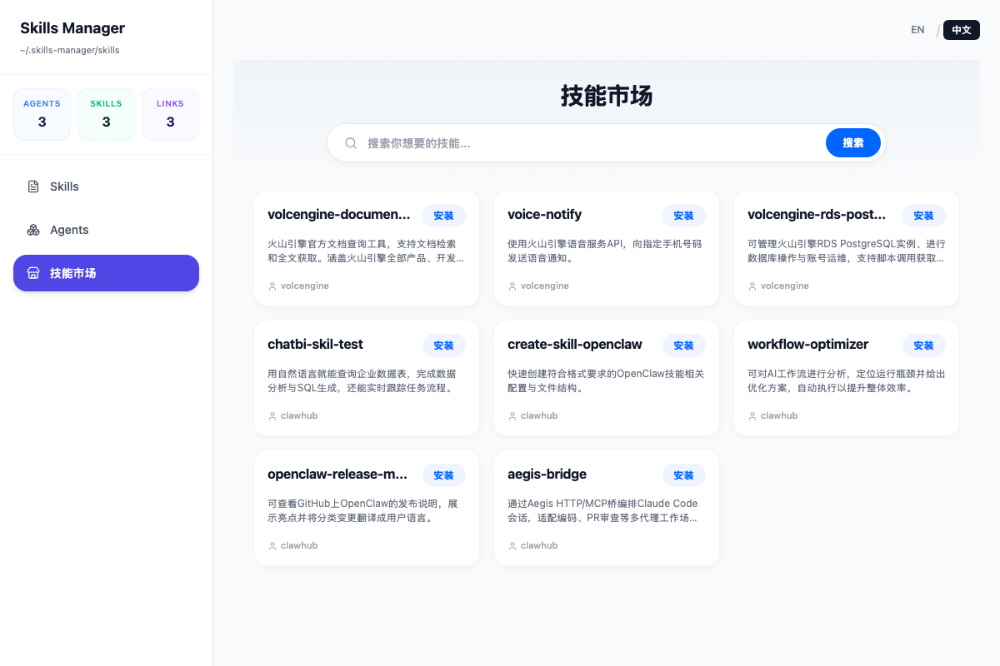

# Skill Manager

Skill Manager 是一个基于 Tauri、React、TypeScript 和 Rust 构建的桌面应用，用于统一管理本地 tools、skills 以及 marketplace 内容，方便进行配置、查看、测试与安装。

## 目录

- [核心能力](#核心能力)
- [界面截图](#界面截图)
- [技术栈](#技术栈)
- [快速开始](#快速开始)
- [开发命令](#开发命令)
- [构建发布](#构建发布)
- [测试](#测试)
- [项目结构](#项目结构)

## 核心能力

- **Skills 管理**：查看、编辑、创建和删除本地 skill 文件，支持路径自定义（默认 `~/.<tool-id>/skills`）。
- **Agents (Tools) 管理**：统一管理本地 Agents 配置，并为每个 Agent 绑定对应的 skill。简化了配置项，支持快速复制和调整路径。
- **技能市场 (Marketplace)**：浏览、检索社区中的 skills。支持 Markdown 详情预览（富文本解析渲染），支持一键下载、解压并自动安装到本地。
- **桌面端体验**：基于 Tauri 构建，具备更轻量的桌面应用体验。拥有侧边栏概览、多语言切换等现代化 UI 布局。
- **现代前端栈**：使用 React、TypeScript、Redux Toolkit 和 Tailwind CSS 构建界面与状态管理，UI 采用极致精简的设计风格。

## 界面截图

### Skills



### Tools (Agents)


### 技能市场 (Marketplace)



## 技术栈

- [React](https://reactjs.org/)
- [TypeScript](https://www.typescriptlang.org/)
- [Tauri](https://v2.tauri.app/)
- [Rust](https://www.rust-lang.org/)
- [Vite](https://vitejs.dev/)
- [Tailwind CSS](https://tailwindcss.com/)
- [Redux Toolkit](https://redux-toolkit.js.org/)
- [Playwright](https://playwright.dev/)
- [Vitest](https://vitest.dev/)

## 快速开始

### 环境要求

- [Node.js](https://nodejs.org/en/) 18+
- [npm](https://www.npmjs.com/)
- [Rust](https://www.rust-lang.org/tools/install)

### 安装依赖

```bash
npm install
```

### 启动开发环境

```bash
npm run tauri dev
```

## 开发命令

```bash
# 前端开发
npm run dev

# Tauri 开发
npm run tauri dev

# 前端构建
npm run build

# 运行全部测试
npm run test

# 仅运行单元测试
npm run test:unit

# 仅运行 E2E 测试
npm run test:e2e
```

## 构建发布

### 默认构建

```bash
npm run tauri build
```

构建产物默认位于 `src-tauri/target/release/bundle`。

### 打包成 macOS DMG

若需专门打包为 macOS 下的 `.dmg` 安装包，请执行以下命令：

```bash
npm run tauri build -- --bundles dmg
```

> **提示**：在 macOS 环境下，默认的 `npm run tauri build` 也会在 `src-tauri/target/release/bundle/dmg` 目录下生成 DMG 文件。

### 打包成 Windows 安装包 (EXE / MSI)

若需专门打包为 Windows 下的安装包（需在 Windows 环境下运行），请执行以下命令：

```bash
# 打包为独立的 exe 安装程序 (基于 NSIS)
npm run tauri build -- --bundles nsis

# 打包为 MSI 安装包
npm run tauri build -- --bundles msi
```

## 测试

项目使用 Vitest 和 Playwright：

- `npm run test`
- `npm run test:unit`
- `npm run test:e2e`

## 项目结构

```text
.
├── src/                 # React 前端代码
│   ├── components/      # 通用组件
│   ├── lib/             # API 与工具函数
│   ├── store/           # Redux 状态管理
│   └── views/           # Skills / Tools / Marketplace 页面
├── src-tauri/           # Tauri Rust 后端与应用配置
├── skills/              # 本地 skills 示例或配置目录
├── tests/               # E2E 测试
└── screenshots/         # README 截图资源
```
