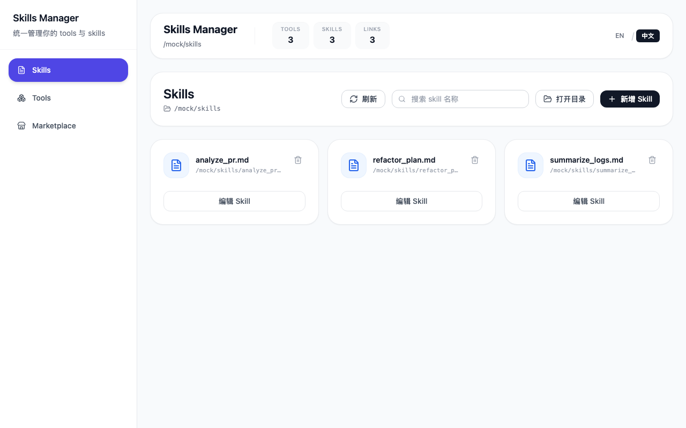
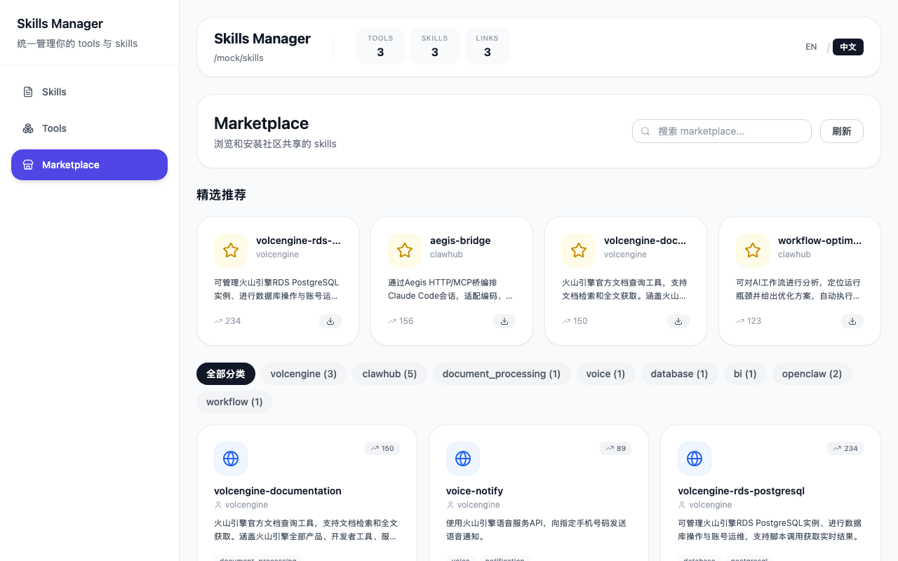

# Skill Manager





Skill Manager 是一款基于 Tauri 框架和 React 的桌面应用，用于集中管理、配置和测试你的各种开发工具与技能 (Skills)。它集成了一个 Marketplace 能够让你方便地发现和管理相关能力。

## 主要特性

- **技能管理 (Skills Management)**: 集中配置、查看和调整各项技能。
- **本地工具管理 (Tools Integration)**: 配置和调用本地环境中的各种开发辅助工具。
- **应用市场 (Marketplace)**: 浏览、检索推荐插件和扩展能力。
- **配置同步 (Config Sync)**: 基于本地存储系统进行数据同步，并提供便捷的配置导入/导出。
- **响应式界面**: 通过 Tailwind CSS 打造支持桌面端的现代 UI。

## 技术栈

- [React](https://reactjs.org/) + [TypeScript](https://www.typescriptlang.org/) (前端 UI 框架)
- [Tauri](https://v2.tauri.app/) (跨平台桌面应用构建框架, 使用 Rust 作为后端底座)
- [Vite](https://vitejs.dev/) (前端构建与开发工具)
- [Tailwind CSS](https://tailwindcss.com/) (样式解决方案)
- [Redux Toolkit](https://redux-toolkit.js.org/) (状态管理)
- [Lucide React](https://lucide.dev/) (图标库)

## 开始使用

### 前置要求

在运行该项目之前，需要确保你的开发环境中已经安装了以下依赖：

- [Node.js](https://nodejs.org/en/) (推荐 >= 18.x)
- [npm](https://www.npmjs.com/) 或 [pnpm](https://pnpm.io/)
- [Rust](https://www.rust-lang.org/tools/install) 环境 (用于编译 Tauri)

### 运行环境配置

1. 安装前端依赖:
   ```bash
   npm install
   ```

2. 启动开发服务器 (包含前端热重载与 Tauri 后端):
   ```bash
   npm run tauri dev
   ```

### 生产构建

如果你需要构建用于发布的安装包：

```bash
npm run tauri build
```
构建产物将会生成在 `src-tauri/target/release/bundle` 目录下。

## 测试

本项目使用 Playwright 和 Vitest 进行测试:

- 运行组件测试: `npm run test`
- 运行 E2E 测试: (如果配置了 Playwright)

## 项目结构简介

- `src/` - React 前端代码
  - `components/` - React 视图组件（如 MarketplaceView, SkillsView, ToolsView 等）
  - `store/` - Redux 状态管理配置
  - `lib/` - 工具函数及 API 封装
- `src-tauri/` - Rust 后端代码及 Tauri 配置
- `skills/` - 技能相关的配置文件

